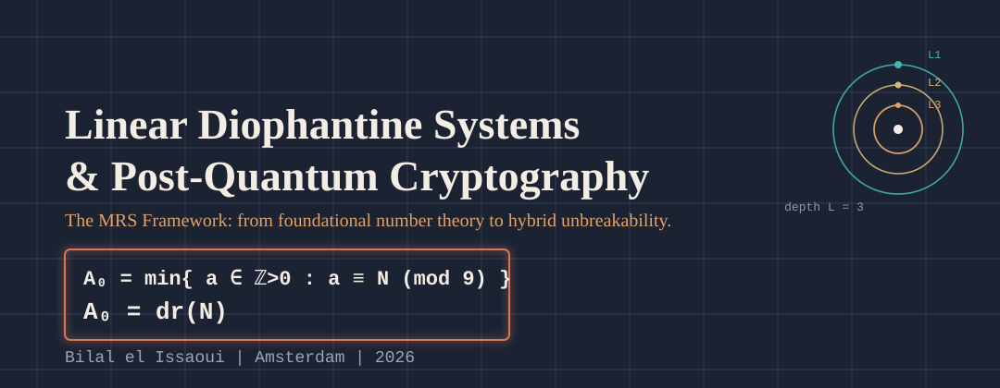

I work on the mathematics behind deterministic systems — from linear Diophantine
representation theory to a post-quantum authentication framework built on it (MRS-AUTH).

**Research focus**
- Linear Diophantine representation systems (the MRS(19,9) framework)
- Post-quantum, coercion-resistant authentication (MRS-AUTH)
- Computational number theory applied to cryptographic and systems design

**Tech stack**
`Rust` · `Python` · `HTML`

Amsterdam · [GitHub](https://github.com/A19dammer91)
