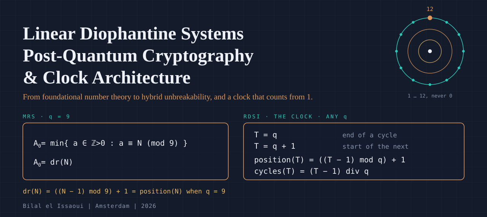

I work on the mathematics behind deterministic systems — from linear Diophantine
representation theory to a post-quantum authentication framework built on it (MRS-AUTH),
and a clock structure where counting from 1 removes the boundary cases (RDSI).

**Research focus**
- Linear Diophantine representation systems with p ≡ 1 (mod q), such as the MRS(19,9) framework (A₀ = dr(N))
- Post-quantum, coercion-resistant authentication (MRS-AUTH)
- Counting from 1: [RDSI, The Hidden Mathematics Behind the Clock](https://github.com/A19dammer91/RDSI-The-Hidden-Mathematics-Behind-the-Clock)
- Computational number theory applied to systems design

**Tech stack**
`Rust` · `Python` · `HTML`

Amsterdam · [GitHub](https://github.com/A19dammer91)
